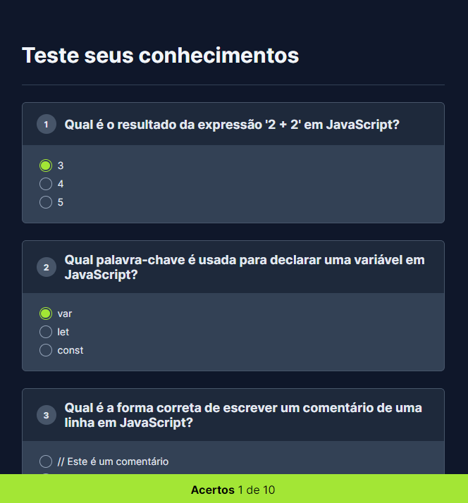

<h1 align="center"> Projeto Quiz </h1>

Projeto criado no Evento NLW Expert da RocketSeat.

  <a href="#-tecnologias">Tecnologias</a>&nbsp;&nbsp;&nbsp;|&nbsp;&nbsp;&nbsp;
  <a href="#-projeto">Projeto</a>&nbsp;&nbsp;&nbsp;|&nbsp;&nbsp;&nbsp;
  <a href="#-licença">Licença</a>

  

 

  

## 🚀 Tecnologias

Esse projeto foi desenvolvido com as seguintes tecnologias:

- HTML e CSS
- JavaScript
- Git e Github
- Figma

## 💻 Projeto

O projeto Quiz é um projeto criado no Evento NLW Expert da RocketSeat aonde forarm aborados varios conteúdos, como Js, HTML e CSS, esse projeto é um projeto de um quiz aonde é contabilizado na hora a sua quantidade de acertos. Acesse o projeto [AQUI](https://yuriverwiebe.github.io/projeto-quiz)

## 📝 Licença

Esse projeto está sob a licença MIT.

---

Feito com ♥ by Yuri Verwiebe 🌊
